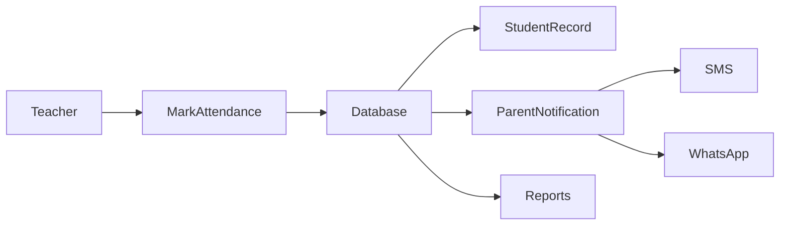
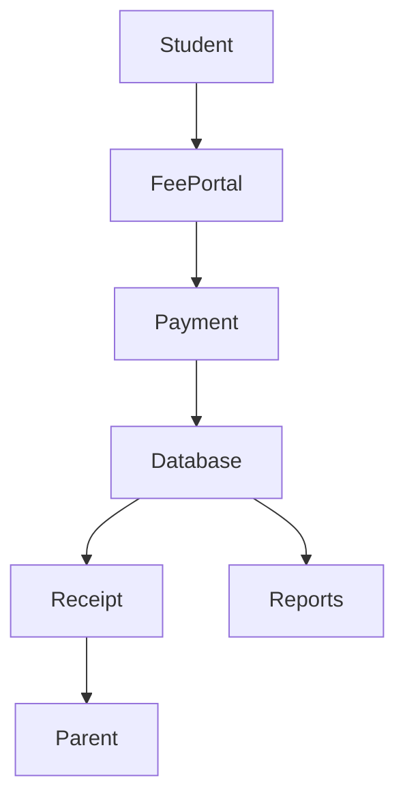
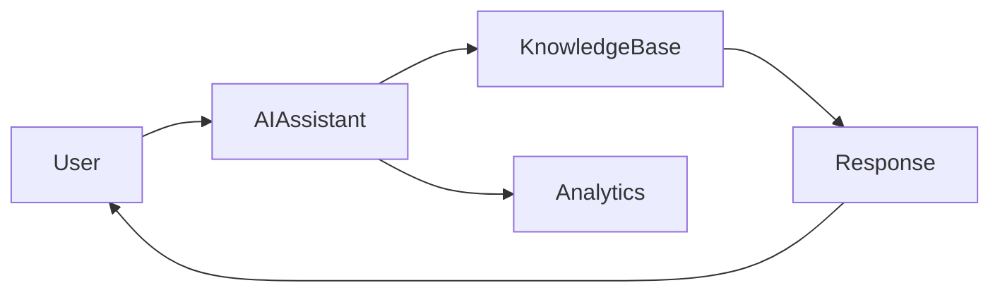
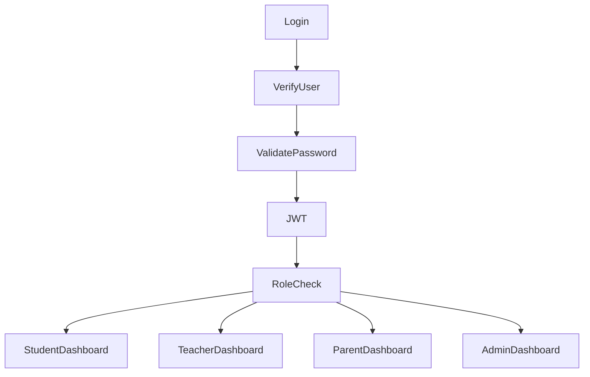
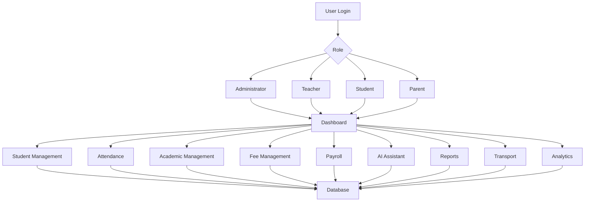
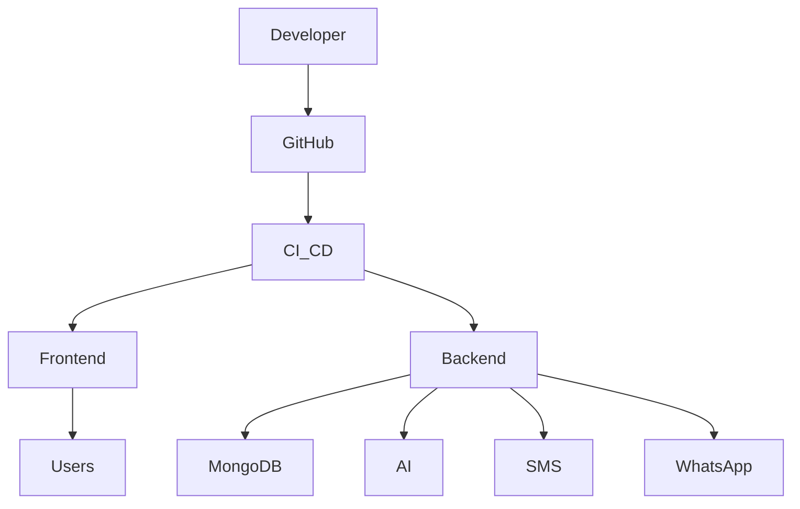

<div align="center">


# 🎓 Edviora

### AI-Powered School ERP & Institution Management Platform

<p align="center">
An intelligent cloud-based ERP platform designed to transform educational institutions through automation, AI, analytics, and seamless collaboration.
</p>

<p align="center">

<a href="https://edviora.online">

</a>


</p>

---

## 🌟 Overview

**Edviora** is a next-generation **AI-powered School ERP platform** built to simplify and automate every aspect of educational institution management.

Instead of using multiple disconnected systems for attendance, academics, fee collection, payroll, communication, transport, analytics, and administration, Edviora integrates everything into **one intelligent cloud platform**.

Designed for **schools, colleges, coaching institutes, and educational organizations**, Edviora provides a secure, scalable, and modern digital ecosystem that reduces administrative effort while enhancing learning outcomes.

---

## 🚀 Vision

Our vision is to empower educational institutions with intelligent technology that makes education more efficient, transparent, and accessible.

Edviora aims to become the complete digital operating system for schools by combining:

- 🤖 Artificial Intelligence
- 📊 Data Analytics
- ☁️ Cloud Computing
- 🔐 Secure Authentication
- 📱 Modern User Experience
- ⚡ Intelligent Automation

---

# ✨ Key Highlights

<table>

<tr>
<td width="50%">

### 📚 Academic Management

- Student Information System
- Attendance Tracking
- AI Study Hub
- Report Cards
- Notes & Resources
- Curriculum Management

</td>

<td width="50%">

### 💰 Finance

- Fee Management
- Payroll
- Salary Records
- Billing
- Due Reminders
- Financial Reports

</td>

</tr>

<tr>

<td>

### 🤖 Artificial Intelligence

- AI Assistant
- Smart Recommendations
- AI Evaluations
- AI Study Support
- AI Analytics

</td>

<td>

### 📈 Administration

- Multi School Support
- Teacher Management
- Timetable
- Notifications
- Transport
- Analytics

</td>

</tr>

</table>

---

# 🎯 Why Choose Edviora?

✅ Modern Dashboard

✅ AI Powered

✅ Enterprise Architecture

✅ Cloud Ready

✅ Secure Authentication

✅ Responsive Design

✅ Mobile Friendly

✅ Role Based Access

✅ Fast Performance

✅ Intelligent Analytics

✅ Easy to Use

✅ Scalable Infrastructure

---

# 👥 User Roles

Edviora provides customized dashboards and permissions for every stakeholder.

| Role | Description |
|------|-------------|
| 👨‍💼 Administrator | Complete institution management |
| 👨‍🏫 Teacher | Attendance, Reports, Classes |
| 👨‍🎓 Student | Learning Resources, Fees, Attendance |
| 👨‍👩‍👧 Parent | Child Progress & Notifications |
| 💰 Accountant | Fee Collection & Payroll |
| 🚌 Transport Manager | Vehicle & Route Management |

---

# 🏗 Enterprise Architecture

> Replace the image below with your architecture diagram.

<p align="center">


</p>

---

# ⚙ Platform Workflow

```text
                    Users
                       │
      ┌────────────────┼────────────────┐
      │                │                │
  Students         Teachers         Parents
      │                │                │
      └────────────────┼────────────────┘
                       │
             Authentication System
                       │
               Role Verification
                       │
                Edviora Dashboard
                       │
       ┌───────────────┼───────────────┐
       │               │               │
 Academics         Finance        Administration
       │               │               │
 AI Assistant      Payroll      Analytics
       │               │               │
             Secure Cloud Database
```

---

# 🏗 Technology Stack

<table>

<tr>

<th>Category</th>

<th>Technology</th>

</tr>

<tr>

<td>Frontend</td>

<td>

React.js

Tailwind CSS

JavaScript

HTML5

CSS3

</td>

</tr>

<tr>

<td>Backend</td>

<td>

Node.js

Express.js

REST APIs

</td>

</tr>

<tr>

<td>Database</td>

<td>

MongoDB

</td>

</tr>

<tr>

<td>Authentication</td>

<td>

JWT

Role Based Access

Secure Sessions

</td>

</tr>

<tr>

<td>AI Integration</td>

<td>

OpenAI APIs

AI Chat Assistant

AI Evaluation

Smart Recommendations

</td>

</tr>

<tr>

<td>Communication</td>

<td>

SMS

WhatsApp

Email Notifications

</td>

</tr>

<tr>

<td>Cloud</td>

<td>

Cloud Hosting

CDN

Secure Storage

</td>

</tr>

</table>

---

# 📂 Project Structure

```text
Edviora
│
├── client/
│   ├── src/
│   │
│   ├── components/
│   ├── layouts/
│   ├── pages/
│   ├── dashboard/
│   ├── hooks/
│   ├── context/
│   ├── assets/
│   ├── services/
│   ├── utils/
│   └── styles/
│
├── server/
│
│   ├── controllers/
│   ├── middleware/
│   ├── models/
│   ├── routes/
│   ├── services/
│   ├── utils/
│   └── config/
│
├── database/
│
├── docs/
│   ├── images/
│   ├── diagrams/
│   └── api/
│
├── public/
│
├── package.json
│
└── README.md
```

---

# 🔐 Security Features

Edviora is designed with security as a core principle.

- 🔒 JWT Authentication
- 🔑 Role-Based Authorization
- 🛡 Secure API Endpoints
- 🔐 Encrypted Password Storage
- 📁 Protected File Access
- 🚫 Unauthorized Access Prevention
- 🔄 Session Management
- 📜 Activity Logging
- ☁ Secure Cloud Infrastructure

---

# 📱 Responsive Design

Edviora works seamlessly across all devices.

| Device | Supported |
|----------|-----------|
| 💻 Desktop | ✅ |
| 🖥 Laptop | ✅ |
| 📱 Mobile | ✅ |
| 📲 Tablet | ✅ |

---

# 📊 Platform Statistics

| Category | Coverage |
|-----------|----------|
| Modules | 25+ |
| Dashboards | 6 |
| AI Features | 5+ |
| Reports | 20+ |
| User Roles | 6 |
| Cloud Ready | ✅ |
| Responsive | ✅ |

---

---

# 📚 Core Platform Modules

Edviora is designed with a modular architecture, allowing institutions to enable or disable features according to their requirements. Every module works independently while seamlessly integrating with the entire ecosystem.

---

# 🎓 Student Management

The Student Management System serves as the central repository for all student-related information.

### Features

- Student Registration
- Student Profile Management
- Digital Student Records
- Student Scholar Register (SR)
- Student Archive
- Student Promotion
- Academic History
- Parent Linking
- Medical Information
- Blood Group Records
- Student Documents
- QR Code Student ID Cards
- Student Search
- Student Transfer
- Physical Growth Records

### Benefits

- Centralized student database
- Easy record retrieval
- Paperless documentation
- Faster administration

---

# 👨‍🏫 Teacher Management

Manage teachers, departments, subjects, schedules, and classroom activities from one dashboard.

### Features

- Teacher Registration
- Subject Assignment
- Class Assignment
- Department Management
- Teacher Attendance
- Teacher Timetable
- Performance Reports
- Leave Management
- Salary Records
- Profile Management

---

# 📅 Attendance Management

A smart attendance system designed for accuracy and automation.

### Features

- Daily Attendance
- Monthly Attendance
- Bulk Attendance
- QR Attendance
- Attendance Reports
- Late Entry Tracking
- Holiday Management
- Leave Tracking
- Attendance Analytics

### Attendance Workflow



---

# 📖 Academic Management

Designed to simplify every academic operation.

### Features

- Subject Management
- Class Management
- Section Management
- Curriculum Registry
- School Calendar
- Notes Management
- Study Guides
- Homework
- Assignments
- AI Study Hub
- AI Evaluations
- Student Help Center

---

# 📝 Examination & Result Management

Automate examination planning and result generation.

### Features

- Exam Scheduling
- Marks Entry
- Grade Calculation
- Report Cards
- Result Analysis
- GPA Calculation
- Rank Generation
- Performance Tracking

---

# 💰 Fee Management

A complete financial management solution.

### Features

- Fee Categories
- Student Billing
- Online Payments
- Due Fee Tracking
- Installment Management
- Fee Receipts
- Payment History
- Bulk Fee CSV Upload
- Automated Fee Reminders
- Scholarship Management

---

## Fee Workflow



---

# 💼 Payroll Management

Simplify employee salary processing.

### Features

- Salary Generation
- Payroll Processing
- Employee Benefits
- Deductions
- Salary Slips
- Bonus Management
- Tax Reports

---

# 🚌 Transport Management

Manage vehicles, routes, and drivers efficiently.

### Features

- Vehicle Management
- Driver Management
- Route Planning
- Student Vehicle Assignment
- GPS Tracking
- Pickup & Drop Monitoring
- Transport Reports

---

# 🤖 AI Assistant

Edviora integrates Artificial Intelligence to enhance learning and administration.

### AI Capabilities

- AI Chat Assistant
- AI Learning Support
- AI Evaluation
- Smart Recommendations
- AI Report Generation
- AI Study Planner
- AI Question Generation
- AI Insights

---

## AI Workflow



---

# 📊 Analytics Dashboard

Transform institutional data into actionable insights.

### Features

- Attendance Analytics
- Academic Performance
- Fee Collection Reports
- Payroll Reports
- Transport Reports
- Student Statistics
- Teacher Performance
- Institution Analytics

---

# 📢 Communication Center

Keep everyone connected through intelligent notifications.

### Features

- SMS Notifications
- WhatsApp Alerts
- Email Notifications
- Parent Notifications
- School Notices
- Emergency Alerts
- Broadcast Messaging

---

# 🏫 Timetable Management

Generate and manage institutional schedules.

### Features

- Teacher Timetable
- Student Timetable
- Classroom Allocation
- Conflict Detection
- Automatic Scheduling
- Timetable Export

---

# 📆 School Calendar

Organize academic events throughout the year.

### Features

- Holidays
- Events
- Examinations
- Parent Meetings
- Important Announcements
- Academic Sessions

---

# 🔐 Authentication & Authorization

A secure role-based access control system.

### User Roles

- Administrator
- Principal
- Teacher
- Student
- Parent
- Accountant
- Transport Manager

---

## Authentication Flow



---

# 📈 Feature Matrix

| Module | Available |
|---------|-----------|
| Student Management | ✅ |
| Teacher Management | ✅ |
| Parent Portal | ✅ |
| Attendance | ✅ |
| AI Assistant | ✅ |
| Study Hub | ✅ |
| Academic Reports | ✅ |
| Examination | ✅ |
| Payroll | ✅ |
| Fee Management | ✅ |
| Transport | ✅ |
| QR Student ID | ✅ |
| GPS Tracking | ✅ |
| School Calendar | ✅ |
| Timetable | ✅ |
| Notifications | ✅ |
| WhatsApp Integration | ✅ |
| SMS Integration | ✅ |
| Analytics | ✅ |
| Reports | ✅ |
| Multi-Tenant Support | ✅ |
| Scholar Register | ✅ |
| Curriculum Registry | ✅ |
| Student Help Center | ✅ |
| Bulk CSV Import | ✅ |

---

# 🔄 Overall System Workflow



---

---

# ⚙️ Installation Guide

## 📋 Prerequisites

Before setting up Edviora, ensure the following are installed:

- Node.js (v18 or above)
- npm / yarn
- MongoDB
- Git

---

## 📥 Clone Repository

```bash
git clone https://github.com/Edviora-Organization/Edviora.git

cd Edviora
```

---

## 📦 Install Dependencies

### Frontend

```bash
cd client
npm install
```

### Backend

```bash
cd ../server
npm install
```

---

## ▶️ Start Development Server

### Backend

```bash
npm run dev
```

### Frontend

```bash
npm run dev
```

---

# 🌍 Environment Variables

Create a `.env` file inside the **server** directory.

```env
PORT=5000

MONGODB_URI=your_mongodb_connection

JWT_SECRET=your_secret_key

CLIENT_URL=http://localhost:5173

OPENAI_API_KEY=your_openai_api_key

EMAIL_USER=your_email

EMAIL_PASSWORD=your_password

TWILIO_ACCOUNT_SID=your_sid

TWILIO_AUTH_TOKEN=your_token

TWILIO_PHONE_NUMBER=your_phone

WHATSAPP_API_KEY=your_whatsapp_key
```

> ⚠️ Never commit your `.env` file to GitHub.

---

# 📡 API Overview

## Authentication

| Method | Endpoint |
|---------|----------|
| POST | `/api/auth/login` |
| POST | `/api/auth/register` |
| POST | `/api/auth/logout` |
| GET | `/api/auth/profile` |

---

## Student

| Method | Endpoint |
|---------|----------|
| GET | `/api/students` |
| POST | `/api/students` |
| PUT | `/api/students/:id` |
| DELETE | `/api/students/:id` |

---

## Attendance

| Method | Endpoint |
|---------|----------|
| GET | `/api/attendance` |
| POST | `/api/attendance` |

---

## Fees

| Method | Endpoint |
|---------|----------|
| GET | `/api/fees` |
| POST | `/api/fees/pay` |

---

## Reports

| Method | Endpoint |
|---------|----------|
| GET | `/api/reports` |
| GET | `/api/analytics` |

---

# ☁️ Deployment Architecture



---

# 🖼️ Application Screenshots

## Dashboard

<p align="center">

</p>

---

## Student Management

<p align="center">

</p>

---

## Attendance Module

<p align="center">

</p>

---

## Fee Management

<p align="center">

</p>

---

## AI Assistant

<p align="center">

</p>

---

## Analytics Dashboard

<p align="center">

</p>

---

# 📈 Performance Goals

| Category | Target |
|-----------|---------|
| Dashboard Load Time | < 2 seconds |
| API Response | < 500 ms |
| Uptime | 99.9% |
| Security | Enterprise Grade |
| Scalability | Multi-Institution |

---

# 🛣️ Product Roadmap

## Phase 1

- ✅ Student Management
- ✅ Attendance
- ✅ Fees
- ✅ Reports
- ✅ Teacher Management
- ✅ Timetable

---

## Phase 2

- ✅ AI Assistant
- ✅ Study Hub
- ✅ QR Student ID
- ✅ Notifications
- ✅ Payroll

---

## Phase 3

- 🔄 Mobile Application
- 🔄 Online Examination
- 🔄 Digital Library
- 🔄 Parent Mobile App
- 🔄 AI Voice Assistant
- 🔄 Video Classroom
- 🔄 Inventory Management
- 🔄 Hostel Management

---

# 🛡️ Security

Edviora follows industry best practices.

- JWT Authentication
- Role-Based Access Control
- Secure Password Hashing
- Protected API Routes
- Input Validation
- Secure Session Management
- Environment Variable Protection
- Activity Logging
- Cloud Deployment Ready

---

# 🤝 Contributing

We welcome contributions from developers around the world.

## Steps

1. Fork this repository

2. Create a new feature branch

```bash
git checkout -b feature/new-feature
```

3. Commit your changes

```bash
git commit -m "Add new feature"
```

4. Push the branch

```bash
git push origin feature/new-feature
```

5. Open a Pull Request.

---

# 📝 Coding Standards

- Follow clean architecture
- Write reusable components
- Use meaningful commit messages
- Write clean documentation
- Test before creating a Pull Request

---

# ❓ Frequently Asked Questions

### Is Edviora open source?

The repository structure is public, while deployment and licensing depend on the project's chosen license.

### Can multiple schools use Edviora?

Yes. The architecture is designed to support multiple institutions.

### Does Edviora support AI?

Yes. AI features include assistance, recommendations, and intelligent workflows.

### Is the application mobile-friendly?

Yes. The UI is responsive across desktop, tablet, and mobile devices.

---

# 📞 Contact

🌐 Website

https://edviora.online

📧 Email

contact@edviora.online

🐙 GitHub

https://github.com/Edviora-Organization

---

# 📜 License

Copyright © 2026 **Edviora**.

All rights reserved.

---

<div align="center">

# ⭐ Support the Project

If you found this project useful, consider giving it a **Star ⭐** on GitHub.

It helps the project grow and motivates future development.

---


## 🎓 Edviora

### Empowering Education Through Technology & Artificial Intelligence

**Built with ❤️ by the Edviora Team**

🌐 https://edviora.online

</div>
